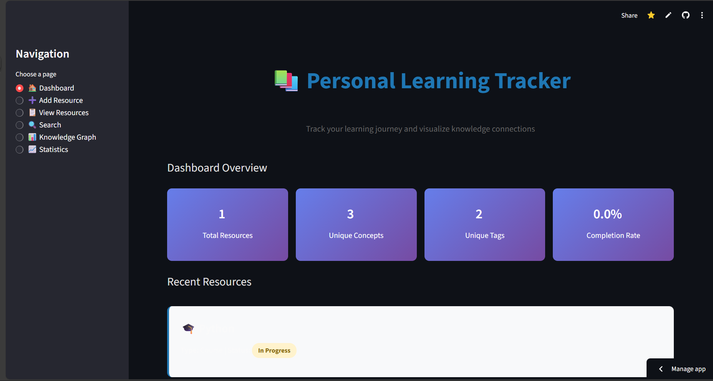
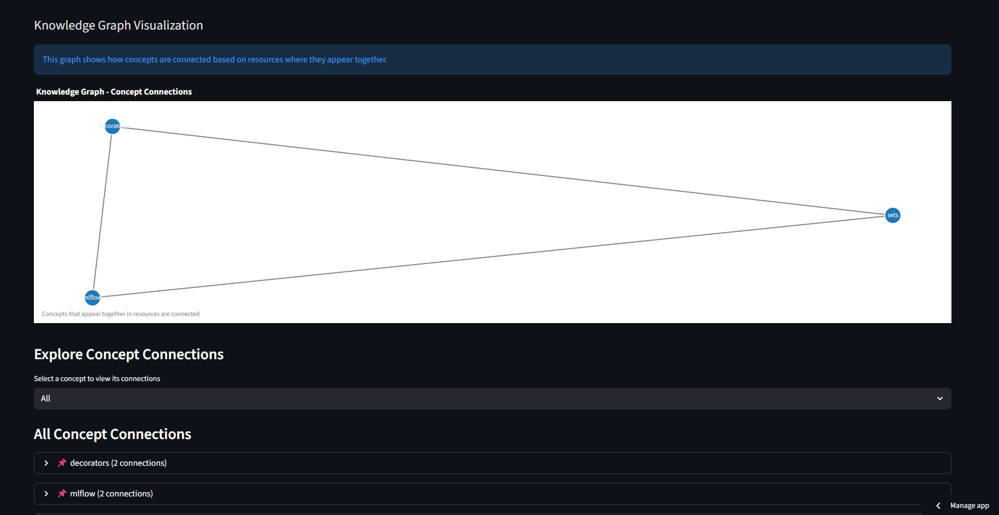
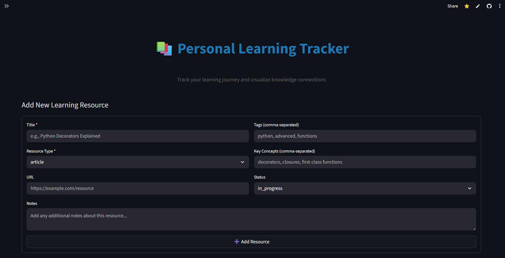
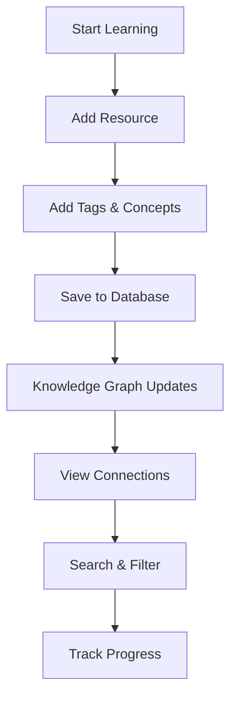

<div align="center">
  <h1>📚 Personal Learning Tracker & Knowledge Graph Builder</h1>
  <p><strong>Track your learning journey and visualize knowledge connections with a beautiful web interface!</strong></p>
  <p>
    
    
    
    
  </p>
</div>

---

## 🌐 Live Demo

[](https://learning-track.streamlit.app)

Try the application online: [Streamlit Cloud](https://learning-track.streamlit.app/)

---

## Features

- 📚 **Track Learning Resources**: Add articles, videos, courses, books with tags and notes
- 🔍 **Search & Filter**: Find resources by title, tags, concepts, or notes
- 📊 **Knowledge Graph**: Automatically builds connections between concepts you learn
- 📈 **Statistics**: View your learning progress and insights
- 💾 **Persistent Storage**: All data saved in JSON format
- 🎨 **Beautiful Web UI**: Modern Streamlit interface with interactive visualizations
- 📄 **Bilingual Documentation**: Complete project documentation in Hindi and English
- 🌙 **Dark Mode Support**: Beautiful interface that adapts to your theme preference

## Screenshots

> **Note:** Add screenshots to a `screenshots/` folder and update paths below

### Dashboard View


### Knowledge Graph


### Add Resource



## Architecture

```
┌─────────────────────────────────────────────────────────────┐
│                    Streamlit Web Interface                  │
│                         (app.py)                            │
└────────────────────┬────────────────────────────────────────┘
                     │
                     ▼
┌─────────────────────────────────────────────────────────────┐
│              LearningTracker Backend Class                  │
│                  (learning_tracker.py)                      │
│  • Add/Update Resources  • Search & Filter                  │
│  • Build Knowledge Graph  • Generate Statistics             │
└────────────────────┬────────────────────────────────────────┘
                     │
                     ▼
┌─────────────────────────────────────────────────────────────┐
│                    JSON Database Storage                    │
│                  (learning_db.json)                         │
└─────────────────────────────────────────────────────────────┘
```

## Tech Stack

- **Frontend**: Streamlit
- **Backend**: Python 3.7+
- **Visualization**: Plotly, NetworkX
- **Data Storage**: JSON
- **Documentation**: ReportLab (PDF)

## Installation

### Installation Process

```
1. Clone Repository
   └─> git clone https://github.com/yourusername/learning-tracker.git

2. Install Dependencies
   └─> pip install -r requirements.txt

3. Run Application
   └─> streamlit run app.py

4. Open Browser
   └─> http://localhost:8501
```

### Required Packages

Install all required packages:

```bash
pip install -r requirements.txt
```

**Dependencies:**

- `streamlit` - Web framework for the UI
- `plotly` - Interactive visualizations
- `networkx` - Graph algorithms for knowledge graph
- `reportlab` - PDF generation for documentation

## Quick Start

### Option 1: Web Interface (Recommended)

Run the Streamlit web application for the best user experience:

```bash
# Install dependencies
pip install -r requirements.txt

# Run the Streamlit app
streamlit run app.py
```

The app will open in your default web browser with a beautiful, interactive interface!

### Option 2: Command Line Interface

For a simple CLI experience:

```bash
python learning_tracker.py
```

## Usage Examples

### Add a Resource

```
Title: Python Decorators Explained
Type: article
URL: https://example.com/decorators
Tags: python, advanced, functions
Key concepts: decorators, closures, first-class functions
Notes: Great explanation of how decorators work
```

### View Knowledge Graph

The tool automatically connects concepts that appear together in resources. For example, if you learn "decorators" and "closures" in the same article, they'll be connected in the knowledge graph.

#### Knowledge Graph Example

The system automatically creates connections between concepts:

```
Concept A ──────┐
                │
Concept B ──────┼───── Concept C
                │
Concept D ──────┘
```

When concepts appear together in resources, they form connections in the knowledge graph.

### Search Resources

Search by any keyword - title, tags, concepts, or notes.

## Data Flow

```
User Input → Streamlit UI → LearningTracker Class
                                    ↓
                            Process & Validate
                                    ↓
                            Update JSON Database
                                    ↓
                            Build Knowledge Graph
                                    ↓
                            Update UI Display
```

## Workflow



### Example Workflow Steps

1. Add resources as you learn (articles, videos, courses)
2. Tag them with relevant topics
3. Extract key concepts from each resource
4. View the knowledge graph to see how concepts connect
5. Use search to quickly find related resources

## Web Interface Features

The Streamlit web interface (`app.py`) provides:

- 🏠 **Dashboard**: Overview with statistics and recent resources
- ➕ **Add Resource**: Easy form to add new learning resources
- 📋 **View Resources**: Browse all resources with filtering options
- 🔍 **Search**: Powerful search across all resource fields
- 📊 **Knowledge Graph**: Interactive visualization of concept connections
- 📈 **Statistics**: Detailed analytics with charts and graphs

## Feature Comparison

| Feature         | CLI Version | Web Interface    |
| --------------- | ----------- | ---------------- |
| Add Resources   | ✅          | ✅               |
| Search          | ✅          | ✅               |
| Knowledge Graph | ✅ (Text)   | ✅ (Interactive) |
| Statistics      | ✅          | ✅ (Charts)      |
| Filtering       | ✅          | ✅ (Advanced)    |
| Dark Mode       | ❌          | ✅               |
| Visualizations  | ❌          | ✅               |

## Why This is Useful

- **Build a Personal Knowledge Base**: Track everything you learn in one place
- **Discover Connections**: See how different concepts relate to each other
- **Find Related Content**: When learning about "async programming", find all related resources
- **Track Progress**: See what you've completed and what's in progress
- **Beautiful Visualizations**: Interactive charts and knowledge graph visualizations
- **Easy to Use**: Intuitive web interface that makes tracking learning effortless

## Data Storage

All data is stored in `learning_db.json` - a simple, human-readable JSON file. You can edit it directly or use the CLI.

## Project Structure

```
learning-tracker/
├── learning_tracker.py    # Core backend class with all business logic
├── app.py                  # Streamlit web application (main interface)
├── demo.py                 # Demo script showing example usage
├── learning_db.json        # JSON database file (auto-created)
├── requirements.txt        # Python package dependencies
└── README.md              # Project documentation
```

## Running the Application

```bash
streamlit run app.py
```

The application will start on `http://localhost:8501`

## Contributing

Contributions are welcome! Please feel free to submit a Pull Request.

1. Fork the repository
2. Create your feature branch (`git checkout -b feature/AmazingFeature`)
3. Commit your changes (`git commit -m 'Add some AmazingFeature'`)
4. Push to the branch (`git push origin feature/AmazingFeature`)
5. Open a Pull Request

## 🗺️ Roadmap

- [ ] Export data to CSV/Excel
- [ ] Import resources from external sources
- [ ] Collaborative features
- [ ] Mobile app version
- [ ] AI-powered concept extraction
- [ ] Spaced repetition reminders
- [ ] Export knowledge graph as image
- [ ] Integration with learning platforms

## License

This project is licensed under the MIT License - see the [LICENSE](LICENSE) file for details.

## 📧 Contact

- **Issues**: [GitHub Issues](https://github.com/jatinnama7/learning-tracker/issues)
- **Email**: jatinnama7.com

---

<div align="center">
  <p><strong>Start tracking your learning journey today! 🚀</strong></p>
  <p>Made with ❤️ by Jatin using Python and Streamlit</p>
</div>
